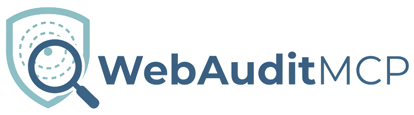

<div align="center">



# WebAuditMCP

**Professional Web Auditing Tool for AI Agents & Developers**

[](https://www.python.org/)
[](https://nodejs.org/)
[](https://github.com/jlowin/fastmcp)
[](https://github.com/GoogleChrome/lighthouse)
[](https://playwright.dev/)
[](https://github.com/dequelabs/axe-core)
[](https://www.docker.com/)
[](https://code.visualstudio.com/)

[English](#english) • [Español](#español) • [Português](#português) • [中文](#中文)

</div>

---

<a name="english"></a>

## 🌟 What is WebAuditMCP?

WebAuditMCP is a comprehensive web auditing MCP (Model Context Protocol) server that enables AI agents to perform professional-grade website audits. It integrates multiple industry-standard tools into a single, unified interface optimized for AI-driven workflows.

### 🛠️ Available Tools

| Tool | Purpose |
|------|---------|
| **Lighthouse** | Performance, SEO, Best Practices auditing with Core Web Vitals |
| **axe Accessibility** | WCAG 2.0/2.1 compliance testing and accessibility violation detection |
| **WAVE** | Alternative accessibility scanner with visual reporting |
| **Security Headers** | HTTP security headers analysis (CSP, HSTS, X-Frame-Options, etc.) |
| **WebHint** | Best practices scanner for modern web development |
| **Responsive Audit** | Multi-viewport testing for mobile/tablet/desktop compatibility |
| **OWASP ZAP** | Security vulnerability scanning (SQL injection, XSS, CSRF, etc.) |
| **Chrome DevTools MCP** | Browser automation, screenshots, network inspection, console logs |
| **Report Merge** | Consolidate multiple audit results with scoring and budgets |

### ⚡ Quick Start

#### Prerequisites

```bash
# Required
- Python 3.12+
- Node.js 22+
- VS Code with MCP support

# Optional (for Docker mode)
- Docker Desktop
```

#### Installation

**Option 1: Local Mode (Recommended)**

```bash
# 1. Clone repository
git clone https://github.com/iberi22/WebAuditMCP.git
cd WebAuditMCP

# 2. Install Python dependencies
pip install -r requirements.txt

# 3. Install Node.js dependencies
cd node-tools
npm install
cd ..

# 4. Install Playwright browsers
playwright install chromium

# 5. Configure environment
cp .env.example .env
# Edit .env with your API keys (WAVE_API_KEY optional)
```

**Option 2: Docker Mode**

```bash
# Build and start container
docker-compose -f docker/docker-compose.yml up -d --build

# Check status
docker logs mcp-auditor
```

#### VS Code Configuration

**Local Mode (STDIO - Recommended)**

Add to `.vscode/mcp.json`:

```json
{
  "servers": {
    "webaudit": {
      "command": "python",
      "args": ["e:\\path\\to\\WebAuditMCP\\mcp\\server.py"],
      "env": {
        "CHROME_MCP_ENABLED": "true",
        "PYTHONUNBUFFERED": "1"
      }
    }
  }
}
```

**Docker Mode (HTTP - Advanced)**

Add to `.vscode/mcp.json`:

```json
{
  "servers": {
    "auditor-docker": {
      "url": "http://localhost:8000/mcp"
    }
  }
}
```

> **Note**: Docker HTTP mode requires additional server configuration. See [Docker Configuration](#docker-configuration) section below.


### 📝 Professional Audit Prompts

We provide battle-tested prompts for comprehensive audits. Each prompt generates a **single Markdown report** optimized for AI iteration.

#### Quick Reference

```bash
prompts/
├── complete-audit.md          # Full website audit (all categories)
├── security/
│   ├── headers-audit.md       # HTTP security headers
│   ├── vulnerabilities.md     # OWASP ZAP security scan
│   └── ssl-tls.md            # Certificate and HTTPS validation
├── accessibility/
│   ├── wcag-compliance.md     # WCAG 2.1 AA/AAA compliance
│   ├── screen-reader.md       # Assistive technology testing
│   └── keyboard-navigation.md # Keyboard accessibility
├── performance/
│   ├── core-web-vitals.md     # LCP, FID, CLS metrics
│   ├── lighthouse-full.md     # Complete Lighthouse audit
│   └── mobile-performance.md  # Mobile-specific performance
├── visual/
│   ├── responsive-design.md   # Multi-device layout testing
│   ├── cross-browser.md       # Browser compatibility
│   └── visual-regression.md   # Screenshot comparison
└── styles-layouts/
    ├── design-system.md       # Style consistency audit
    ├── typography.md          # Font and readability
    └── color-contrast.md      # WCAG color contrast ratios
```

### 🎯 Usage Examples

#### Example 1: Complete Website Audit

```
Using WebAuditMCP, perform a comprehensive audit of https://example.com following the complete-audit.md prompt. Generate a single Markdown report with:
1. Executive summary with scores
2. Critical issues by priority
3. Actionable recommendations
4. Before/after comparison if baseline exists
```

#### Example 2: Security-Focused Audit

```
Execute security audit on https://myapp.com using:
1. security/headers-audit.md prompt
2. security/vulnerabilities.md prompt
Generate consolidated security report with risk levels and remediation steps.
```

#### Example 3: Accessibility Compliance

```
Audit https://website.com for WCAG 2.1 AA compliance using accessibility/wcag-compliance.md. Include:
- Automated axe-core scan
- Manual WAVE review
- Screen reader compatibility notes
- Remediation priority matrix
```

### 🔧 Tool-Specific Usage

#### Health Check

```python
# Verify all dependencies and tool availability
health_check()
```

#### Lighthouse Performance Audit

```python
# Mobile audit with all categories
audit_lighthouse(
    url="https://example.com",
    device="mobile"
)

# Desktop audit
audit_lighthouse(
    url="https://example.com",
    device="desktop"
)
```

#### Accessibility Scan (axe)

```python
# Desktop accessibility audit
scan_axe(
    url="https://example.com",
    device="desktop"
)
```

#### Security Headers Analysis

```python
# Check HTTP security headers
security_headers(url="https://example.com")
```

#### Responsive Design Testing

```python
# Test multiple viewports
responsive_audit(
    url="https://example.com",
    viewports=["375x667", "768x1024", "1920x1080"]
)
```

#### OWASP ZAP Security Scan

```python
# Quick baseline security scan (5 minutes)
zap_baseline(
    url="https://example.com",
    minutes=5
)
```

#### Report Consolidation

```python
# Merge multiple audit results with budget enforcement
report_merge(
    items=[lighthouse_result, axe_result, security_result],
    budgets={
        "accessibility": 95,
        "performance": 90,
        "security": 85
    }
)
```

### 📊 Output Format

All audit results return structured JSON:

```json
{
  "status": "ok",
  "url": "https://example.com",
  "timestamp": "2025-10-29T03:30:00Z",
  "scores": {
    "overall": 85,
    "performance": 90,
    "accessibility": 95,
    "security": 70
  },
  "issues": [...],
  "recommendations": [...],
  "artifacts": {
    "screenshots": ["path/to/screenshot.png"],
    "reports": ["path/to/report.html"]
  }
}
```

### 🌍 Language Support

Reports can be generated in multiple languages. Set environment variable:

```bash
export AUDIT_LANGUAGE=es  # Spanish
export AUDIT_LANGUAGE=pt  # Portuguese
export AUDIT_LANGUAGE=zh  # Chinese
export AUDIT_LANGUAGE=en  # English (default)
```

### 🆘 Troubleshooting

**Lighthouse fails with "command not found":**
- Ensure Node.js 22+ is installed
- Tool will auto-install on first run via `npx -y lighthouse`

**Chrome DevTools not connecting:**
- Check `CHROME_MCP_ENABLED=true` in environment
- Verify Chrome/Chromium is installed

**WAVE API errors:**
- Add `WAVE_API_KEY` to `.env` file
- Get free API key at https://wave.webaim.org/api/

**Lighthouse requires internet on first run:**
- First execution downloads Lighthouse via npx (requires internet)
- Subsequent runs use cached version
- For offline mode, pre-install: `npm install -g lighthouse`

### 🐳 Docker Configuration

**Current Status**: Docker HTTP mode is under development. The server currently supports STDIO transport (local mode) which is the recommended configuration for VS Code.

**Planned Docker HTTP Configuration**:

The following configuration is planned for future releases:

```json
{
  "servers": {
    "auditor-docker": {
      "url": "http://localhost:8000/mcp"
    }
  }
}
```

**What's Missing**:
- FastMCP HTTP server endpoint configuration
- Docker container health checks for HTTP endpoint
- Documentation for troubleshooting Docker WSL2 issues on Windows

**Workaround**: Use local STDIO mode (see [VS Code Configuration](#vs-code-configuration) section above) which is fully functional and recommended.

**Tracking**: See TASK.md roadmap section R-D-01 through R-D-05 for implementation progress.

### 📚 Documentation

- [Complete Audit Prompts](./prompts/) - Professional audit templates
- [Docker Setup](./DOCKER_RESTART_GUIDE.md) - Container configuration
- [Corrections Log](./CORRECTIONS_SUMMARY.md) - Version 1.1.0 improvements
- [VS Code Integration](./VSCODE_INTEGRATION.md) - MCP setup guide

### 🤝 Contributing

Contributions welcome! This tool is designed for AI agent workflows.

### 📄 License

MIT License - See [LICENSE](LICENSE) for details.

---

<a name="español"></a>

## 🌟 ¿Qué es WebAuditMCP?

WebAuditMCP es un servidor MCP (Model Context Protocol) integral de auditoría web que permite a agentes de IA realizar auditorías profesionales de sitios web. Integra múltiples herramientas estándar de la industria en una única interfaz unificada optimizada para flujos de trabajo impulsados por IA.

### 🛠️ Herramientas Disponibles

| Herramienta | Propósito |
|-------------|-----------|
| **Lighthouse** | Auditoría de rendimiento, SEO y mejores prácticas con Core Web Vitals |
| **axe Accessibility** | Pruebas de conformidad WCAG 2.0/2.1 y detección de violaciones de accesibilidad |
| **WAVE** | Escáner de accesibilidad alternativo con informes visuales |
| **Security Headers** | Análisis de encabezados de seguridad HTTP (CSP, HSTS, X-Frame-Options, etc.) |
| **WebHint** | Escáner de mejores prácticas para desarrollo web moderno |
| **Responsive Audit** | Pruebas multi-viewport para compatibilidad móvil/tablet/escritorio |
| **OWASP ZAP** | Escaneo de vulnerabilidades de seguridad (SQL injection, XSS, CSRF, etc.) |
| **Chrome DevTools MCP** | Automatización de navegador, capturas de pantalla, inspección de red |
| **Report Merge** | Consolida múltiples resultados de auditoría con puntuación y presupuestos |

### ⚡ Inicio Rápido

**Instalación Local:**

```bash
# 1. Clonar repositorio
git clone https://github.com/tuusuario/WebAuditMCP.git
cd WebAuditMCP

# 2. Instalar dependencias
pip install -r requirements.txt
cd node-tools && npm install && cd ..

# 3. Configurar VS Code
# Agregar servidor MCP en .vscode/mcp.json

# 4. Ejecutar servidor
python mcp/server.py
```

### 📝 Prompts Profesionales

Consulta la carpeta `prompts/` para plantillas de auditoría completas organizadas por categoría.

**Ejemplo de uso:**

```
Usando WebAuditMCP, audita https://ejemplo.com siguiendo el prompt prompts/complete-audit.md.
Genera un informe Markdown único con resumen ejecutivo, issues críticos y recomendaciones.
```

### 🔧 Uso de Herramientas

Ver sección en inglés para ejemplos de código completos.

### 📚 Documentación

- [Prompts de Auditoría](./prompts/) - Plantillas profesionales
- [Guía Docker](./DOCKER_RESTART_GUIDE.md)
- [Resumen de Correcciones](./CORRECTIONS_SUMMARY.md)

---

<a name="português"></a>

## 🌟 O que é WebAuditMCP?

WebAuditMCP é um servidor MCP (Model Context Protocol) abrangente de auditoria web que permite que agentes de IA realizem auditorias profissionais de sites. Integra múltiplas ferramentas padrão da indústria em uma única interface unificada otimizada para fluxos de trabalho orientados por IA.

### 🛠️ Ferramentas Disponíveis

| Ferramenta | Propósito |
|------------|-----------|
| **Lighthouse** | Auditoria de desempenho, SEO e melhores práticas com Core Web Vitals |
| **axe Accessibility** | Testes de conformidade WCAG 2.0/2.1 e detecção de violações de acessibilidade |
| **WAVE** | Scanner de acessibilidade alternativo com relatórios visuais |
| **Security Headers** | Análise de cabeçalhos de segurança HTTP (CSP, HSTS, X-Frame-Options, etc.) |
| **WebHint** | Scanner de melhores práticas para desenvolvimento web moderno |
| **Responsive Audit** | Testes multi-viewport para compatibilidade móvel/tablet/desktop |
| **OWASP ZAP** | Varredura de vulnerabilidades de segurança (SQL injection, XSS, CSRF, etc.) |
| **Chrome DevTools MCP** | Automação de navegador, capturas de tela, inspeção de rede |
| **Report Merge** | Consolida múltiplos resultados de auditoria com pontuação e orçamentos |

### ⚡ Início Rápido

**Instalação Local:**

```bash
# 1. Clonar repositório
git clone https://github.com/seuusuario/WebAuditMCP.git
cd WebAuditMCP

# 2. Instalar dependências
pip install -r requirements.txt
cd node-tools && npm install && cd ..

# 3. Configurar VS Code
# Adicionar servidor MCP em .vscode/mcp.json

# 4. Executar servidor
python mcp/server.py
```

### 📝 Prompts Profissionais

Consulte a pasta `prompts/` para modelos de auditoria completos organizados por categoria.

### 📚 Documentação

- [Prompts de Auditoria](./prompts/)
- [Guia Docker](./DOCKER_RESTART_GUIDE.md)
- [Resumo de Correções](./CORRECTIONS_SUMMARY.md)

---

<a name="中文"></a>

## 🌟 什么是 WebAuditMCP？

WebAuditMCP 是一个全面的网站审计 MCP（模型上下文协议）服务器，使 AI 代理能够执行专业级网站审计。它将多个行业标准工具集成到一个统一的界面中，针对 AI 驱动的工作流程进行了优化。

### 🛠️ 可用工具

| 工具 | 用途 |
|------|------|
| **Lighthouse** | 性能、SEO、最佳实践审计和核心网络指标 |
| **axe Accessibility** | WCAG 2.0/2.1 合规性测试和可访问性违规检测 |
| **WAVE** | 备用可访问性扫描器，提供可视化报告 |
| **Security Headers** | HTTP 安全标头分析（CSP、HSTS、X-Frame-Options 等） |
| **WebHint** | 现代 Web 开发最佳实践扫描器 |
| **Responsive Audit** | 多视口测试，适用于移动/平板/桌面兼容性 |
| **OWASP ZAP** | 安全漏洞扫描（SQL 注入、XSS、CSRF 等） |
| **Chrome DevTools MCP** | 浏览器自动化、截图、网络检查 |
| **Report Merge** | 合并多个审计结果，提供评分和预算 |

### ⚡ 快速开始

**本地安装：**

```bash
# 1. 克隆仓库
git clone https://github.com/yourusername/WebAuditMCP.git
cd WebAuditMCP

# 2. 安装依赖
pip install -r requirements.txt
cd node-tools && npm install && cd ..

# 3. 配置 VS Code
# 在 .vscode/mcp.json 中添加 MCP 服务器

# 4. 运行服务器
python mcp/server.py
```

### 📝 专业审计提示

查看 `prompts/` 文件夹，获取按类别组织的完整审计模板。

### 📚 文档

- [审计提示](./prompts/)
- [Docker 指南](./DOCKER_RESTART_GUIDE.md)
- [更正摘要](./CORRECTIONS_SUMMARY.md)

---

<div align="center">

**Made with ❤️ for AI Agents and Developers**

⭐ Star this repo if WebAuditMCP helps your workflow!

</div>
