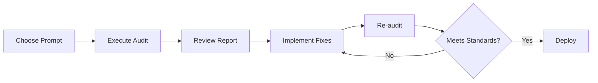

# WebAuditMCP - Professional Audit Prompts

This directory contains battle-tested prompts for comprehensive web auditing. Each prompt generates a single Markdown report optimized for AI agent iteration and stakeholder review.

## 📁 Prompt Categories

### 🎯 [Complete Audit](./complete-audit.md)

**Use when:** Full production-ready assessment needed
**Includes:** Performance, security, accessibility, SEO, responsive design
**Duration:** ~15-20 minutes
**Output:** Consolidated executive report with prioritized action items

### 🔒 Security Audits

| Prompt | Focus | Tools Used | Duration |
|--------|-------|------------|----------|
| [Headers Audit](./security/headers-audit.md) | HTTP security headers (CSP, HSTS, etc.) | `security_headers` | 1-2 min |
| [Vulnerabilities](./security/vulnerabilities.md) | OWASP Top 10 scanning | `zap_baseline` | 10-30 min |

### ♿ Accessibility Audits

| Prompt | Focus | Standard | Tools |
|--------|-------|----------|-------|
| [WCAG Compliance](./accessibility/wcag-compliance.md) | WCAG 2.1 Level AA/AAA | Full compliance check | `scan_axe`, `scan_wave` |

### ⚡ Performance Audits

| Prompt | Focus | Metrics | Tools |
|--------|-------|---------|-------|
| [Core Web Vitals](./performance/core-web-vitals.md) | LCP, FID, CLS optimization | Google's CWV | `audit_lighthouse` |

### 🎨 Visual & Layout Audits

| Prompt | Focus | Devices | Tools |
|--------|-------|---------|-------|
| [Responsive Design](./visual/responsive-design.md) | Multi-viewport testing | 4+ viewports | `responsive_audit` |

### 🖌️ Styles & Colors

| Prompt | Focus | Standard | Tools |
|--------|-------|----------|-------|
| [Color Contrast](./styles-layouts/color-contrast.md) | WCAG contrast ratios | 4.5:1 (AA) | `scan_axe` |

## 🚀 Quick Start

### 1. Choose Your Audit Type

```bash
# For complete website audit
Use: prompts/complete-audit.md

# For specific concerns
Security: prompts/security/headers-audit.md
Accessibility: prompts/accessibility/wcag-compliance.md
Performance: prompts/performance/core-web-vitals.md
```

### 2. Pass Prompt to AI Agent

**Example:**

```
Using WebAuditMCP, execute a complete audit on https://example.com following the template in prompts/complete-audit.md. Generate a single Markdown report with executive summary, critical issues, and actionable recommendations.
```

### 3. Review Generated Report

All prompts output a structured Markdown file with:

- Executive summary with scores
- Critical/High/Medium priority issues
- Specific code fixes with before/after examples
- Compliance status (WCAG, OWASP, etc.)
- Action items with effort estimates

## 📊 Output Format

Each audit generates a single `.md` file:

```
audit-reports/
├── complete-audit-example.com-2025-10-29.md
├── security-headers-example.com-2025-10-29.md
└── accessibility-example.com-2025-10-29.md
```

## 🎯 Best Practices

### For AI Agents

1. **Always run `health_check()` first** to verify tool availability
2. **Check server accessibility** before localhost audits
3. **Use specific URLs** (include protocol: https://)
4. **Reference baseline** if comparing with previous audits
5. **Generate artifacts** (screenshots, JSON reports)

### For Developers

1. **Start with complete audit** for new projects
2. **Run security audits** before production deployments
3. **Check accessibility** on every sprint
4. **Monitor Core Web Vitals** weekly
5. **Automate in CI/CD** for continuous monitoring

## 🔄 Audit Workflow



## 📝 Custom Prompts

You can create custom prompts by combining sections:

```markdown
# Custom Audit: Security + Performance

## Execute
1. Run security/headers-audit.md
2. Run security/vulnerabilities.md
3. Run performance/core-web-vitals.md

## Consolidate
Use report_merge to create unified report
```

## 🆘 Troubleshooting

**Lighthouse fails:**

- Ensure Node.js 22+ installed
- Check if target URL is accessible
- For localhost: verify dev server is running

**ZAP scan timeout:**

- Reduce scan duration (use 5 minutes for quick check)
- Ensure OWASP ZAP is installed (Docker mode)

**axe reports no violations:**

- Excellent! Your site may be accessible
- Consider manual testing for comprehensive coverage

## 🌍 Language Support

Reports can be generated in multiple languages by setting:

```bash
export AUDIT_LANGUAGE=en  # English (default)
export AUDIT_LANGUAGE=es  # Spanish
export AUDIT_LANGUAGE=pt  # Portuguese
export AUDIT_LANGUAGE=zh  # Chinese
```

## 📚 Additional Resources

- [WCAG 2.1 Guidelines](https://www.w3.org/WAI/WCAG21/quickref/)
- [OWASP Top 10](https://owasp.org/www-project-top-ten/)
- [Web.dev - Core Web Vitals](https://web.dev/vitals/)
- [MDN - Accessibility](https://developer.mozilla.org/en-US/docs/Web/Accessibility)

## 🤝 Contributing

Want to add a new prompt template? Please:

1. Follow existing structure
2. Include clear objectives
3. Provide code examples
4. Specify expected output format

---

**Last Updated:** 2025-10-29
**Version:** 1.0
**Maintained by:** WebAuditMCP Contributors
